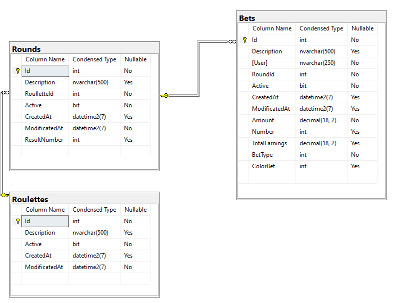

# RouletteGame

## Descripción
Roulette API es un servicio REST desarrollado en **ASP.NET Core** con **Entity Framework** y **SQL Server**, diseñado para gestionar ruletas, rondas y apuestas en números (0-36) o colores (rojo/negro).

## Tecnologías utilizadas
- **.NET 8**: Framework de desarrollo.
- **SQL Server**: Base de datos relacional.
- **Entity Framework Core**: ORM para interactuar con SQL Server.
- **Serilog**: Biblioteca para logging.
- **Docker**: Contenedores para ejecutar de ser requerido la aplicación localmente.

## **Características principales**

- **Persistencia**: La aplicación utiliza **SQL Server** para almacenar la información de los permisos.
- **Patrones de diseño**: Se implementan los patrones de **Repositorio**, **Unit of Work** e **Inyección de dependencias**.

## **Requisitos previos**

- **.NET 8 SDK** (o superior)
- **SQL Server** (o Docker para contenedores)

## **Instalación y configuración**

### 1. Clonar el repositorio
```sh
git clone https://github.com/Garnelian/Roulettes-Game.git
cd RoulettesGame
```

### 2. Configurar la base de datos
Modificar `appsettings.json` con la cadena de conexión de SQL Server:
```json
"ConnectionStrings": {
  "DefaultConnection": "Server=localhost;Database=RouletteDB;User Id=sa;Password=yourpassword;"
}
```

Ejecutar migraciones:
```sh
dotnet ef database update
```

### 3. Levantar la API
```sh
dotnet run
```
La API estará disponible en `http://localhost:7080`.

## Modelos principales

### **Bet (Apuesta)**
```csharp
public class Bet {
    public int Id { get; set; }
    public string? Description { get; set; }
    public string User { get; set; }
    public BetType BetType { get; set; }
    public int? Number { get; set; }
    public ColorBet? ColorBet { get; set; }
    public decimal Amount { get; set; }
    public decimal? TotalEarnings { get; set; }
    public int RoundId { get; set; }
    public Round? Round { get; set; }
    public bool Active { get; set; } = true;
    public DateTime? CreatedAt { get; set; }
    public DateTime? ModificatedAt { get; set; } = DateTime.Now;
}
```

### **Roulette (Ruleta)**
```csharp
public class Roulette {
    public int Id { get; set; }
    public string? Description { get; set; }
    public List<Round>? Rounds { get; set; }
    public bool Active { get; set; } = false;
    public DateTime? CreatedAt { get; set; }
    public DateTime ModificatedAt { get; set; } = DateTime.Now;
}
```

### **Round (Ronda de apuestas)**
```csharp
public class Round {
    public int Id { get; set; }
    public string? Description { get; set; }
    public int RoulletteId { get; set; }
    public int? ResultNumber { get; set; }
    public Roulette Roullette { get; set; }
    public List<Bet>? Bets { get; set; }
    public bool Active { get; set; } = true;
    public DateTime? CreatedAt { get; set; }
    public DateTime ModificatedAt { get; set; } = DateTime.Now;
}
```
## Modelo Relacional

El modelo relacional generado mediante code first es el siguiente:




## Endpoints

### **1. Crear ruleta**
**POST** `/api/roulettes`
```json
{
  "description": "Ruleta de prueba"
}
```
**Respuesta:**
```json
{
  "RouletteId": 1,
  "Message": "Ruleta creada exitosamente"
}
```

### **2. Abrir una ruleta (crear una ronda)**
**POST** `/api/roulettes/{rouletteId}/rounds`

### **3. Realizar una apuesta**
**POST** `/api/roulettes/{rouletteId}/bets`

En caso de requerirse una apuesta sobre un número por ejemplo:

```json
{
  "user": "userTest",
  "betType": "NumberBet",
  "number": 12,
  "amount": 5000
}
```

En caso de requerirse una apuesta sobre un color por ejemplo:

```json
{
  "user": "userTest",
  "betType": "ColorBet",
  "colorBet":"Red",
  "amount": 1000
}
```

### **4. Cerrar la ruleta y determinar ganadores**
**GET** `/api/roulettes/{rouletteId}/close`

```json
{
    "winningNumber": 16,
    "winningColor": "Red",
    "results": [
        {
            "user": "Alberto",
            "netEarnings": -6000.00
        },
        {
            "user": "Andrea",
            "netEarnings": -9820.00
        },
        {
            "user": "Camilo",
            "netEarnings": 17000.00
        }
    ]
}
```

## Postman collection

Esta es la colección de Postman para hacer test a las funcionalidades. La colección está disponible en la raiz del proyecto con nombre **RouletteGame.postman_collection.json**

**Nota:** las peticiones en postman estan mediante una variable de entorno previamente configurada({{hostGame}}) para entorno local(https://localhost:7080)

## **Logs**

El proyecto usa **Serilog** para el registro de eventos y exepciones. Los logs se almacenan tanto en la consola como en un archivo de texto (`Logs/app.log`).